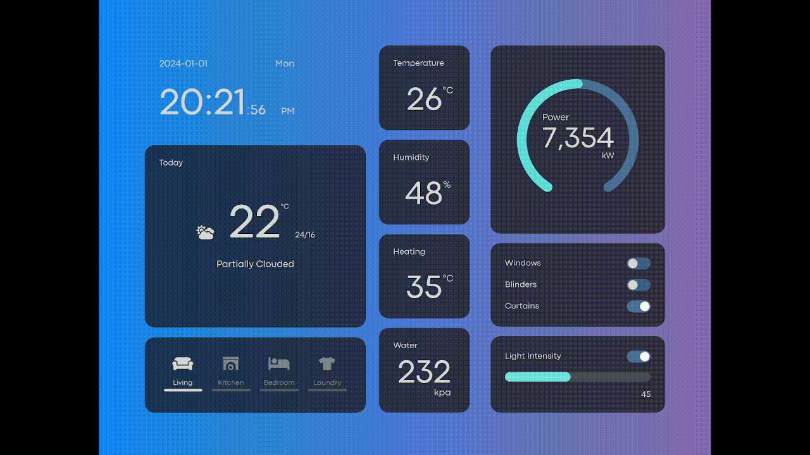
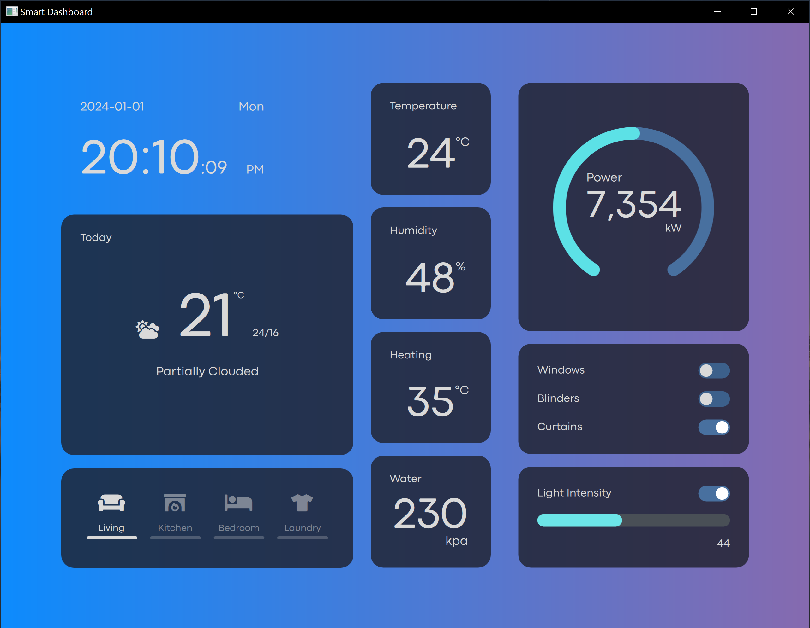

# Smart Dashboard
This is a simple dashboard for a home automation system. Its is implemented from the design dine earlier which can be seen [here](https://www.youtube.com/watch?v=kHnPLOSh7W8).

# Screenshot

# Running
- Qt 6 (Qt 5 works with minor tweaks)
- Qt Creator

# Got questions
Let's connect here:
- [Twitter/X](https://www.twitter.com/allankoechke)
- [Linkedin](https://www.linkedin.com/in/allankoech)
- [CodeArt](https://www.codeart.co.ke)
- [Youtube](https://www.youtube.com/channel/UCRUiTkkMZ2vbCj7sxlVCFGg)